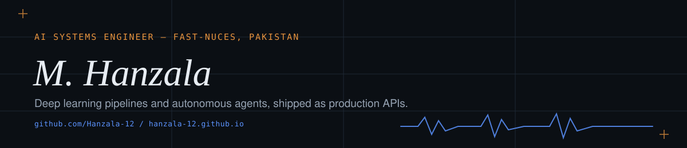

# Hi, I'm M. Hanzala 👋

I build end-to-end AI systems — from deep learning pipelines and autonomous agents to production-ready APIs and full-stack applications. Real systems, not toy demos.

🌐 Portfolio: **[hanzala-12.github.io](https://hanzala-12.github.io)** · 🎓 AI student at **FAST-NUCES**, Pakistan

🔭 Building: a multi-agent LLM system for automated code review & refactoring
🌱 Learning: advanced RAG patterns, edge quantization, multi-modal foundation models

---

## 🚀 Featured Projects

**[Pakistani Politician Image Classifier](https://github.com/Hanzala-12/pakistani-politician-classifier)** — Facial recognition across 16 politicians, three architectures compared. `96.32% test accuracy` on 1,687 MTCNN-aligned images, shipped with a full MLOps stack: DVC, MLflow, Airflow, Docker, FastAPI + React.

**[AutoFix Agent](https://github.com/Hanzala-12/AutoFix-Agent)** — Watches a GitHub issue tracker, reproduces `bug`-tagged issues in a sandbox, and opens a tested pull request itself. `Issue → PR`, no human touch on the diff. Tree-sitter AST context, ReAct loop, Claude/OpenRouter or local Ollama.

**[Lectra-AI](https://github.com/Hanzala-12/lectra-ai)** — Production speech enhancement: noise removal, diarization, transcription. `64× CPU speedup` via hand-written Numba/SIMD DSP (2,950+ lines) on top of DeepFilterNet3, pyannote, faster-whisper.

**[JobSync](https://github.com/Hanzala-12/jobsync)** — A GAME-framework agent that reads postings and resumes, runs skill-gap analysis via Groq/Llama 3, and drafts tailored applications with urgency-aware tracking.

**[LifSync AI Assistant](https://github.com/Hanzala-12/lifsync-ai-assistant)** — A personal AI chief of staff: document intake, task extraction, billing, and reminders in one full-stack platform.

⬇️ More in my pinned repositories below.

---

## 🧰 Stack

`Python` `TypeScript` `PyTorch` `FastAPI` `Docker` `MLflow` `DVC` `Airflow` `React` `NumPy` · [full breakdown →](https://hanzala-12.github.io#toolbox)

---

## 📊 GitHub Stats

---

## 📬 Get in Touch

📧 [yaqoobhanzala@gmail.com](mailto:yaqoobhanzala@gmail.com) · 💼 [LinkedIn](https://www.linkedin.com/in/hanzala-yaqoob-30545a29a/) · 🌐 [Portfolio](https://hanzala-12.github.io)

*Building things that actually work, one pipeline at a time.*
